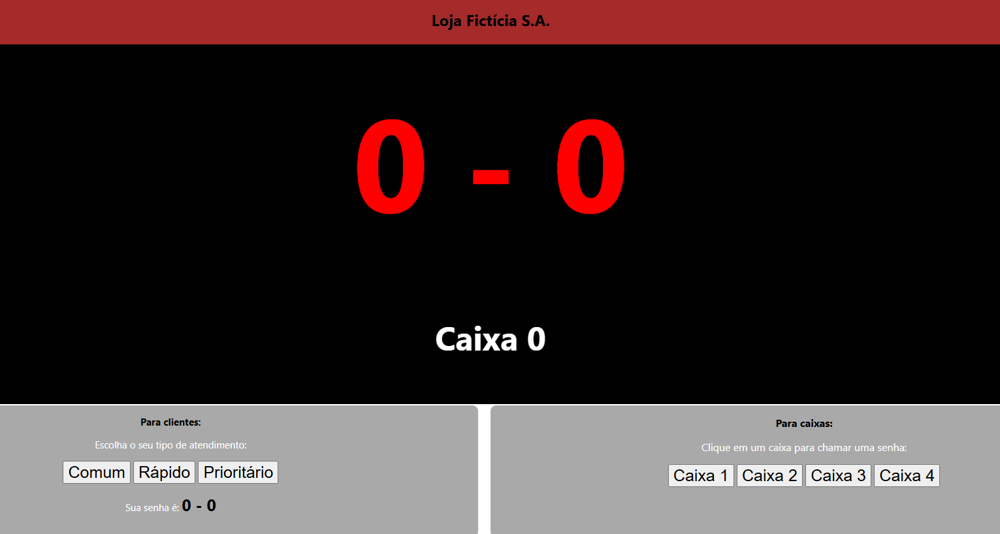

  

<h3 align="center">Projeto de Sistema de Atendimento</h3>

---

 Projeto onde Clientes pedem uma senha e escolhem um caixa
      

  <a href="https://renanvt.github.io/sistema-de-atendimento/">Site do Projeto</a>

## 📝 Tabela de Conteúdos

- [Sobre](#about)
- [Primeiros Passos](#getting_started)
- [Deploy](#deployment)
- [Uso](#usage)
- [Construído com](#built_using)
- [Contribuindo](../CONTRIBUTING.md)
- [Autores](#authors)
- [Agradecimentos](#acknowledgement)
- [Licença](#license)

## 🧐 Sobre 

Projeto pessoal de um sisteminha básico de atendimento. Ele não tem nenhuma tratativa de dados.

## 🏁 Primeiros Passos 

Essas instruções irão te ajudar a obter uma cópia do projeto funcionando na sua máquina local para fins de desenvolvimento e testes. 

### Pré-requisitos

Google Chrome Atualizado.

### Instalação

``
git clone https://github.com/Renanvt/projeto-login.git``

## 🎈 Uso 

Utilize o **Githubdesktop** ou **Git Bash** para clonar no seu computador

## ⛏️ Construído com 

- [Html5](https://developer.mozilla.org/en-US/docs/Glossary/HTML5) - HTML5
- [Css](https://developer.mozilla.org/en-US/docs/Web/CSS/) - CSS
- [JavaScript](https://developer.mozilla.org/en-US/docs/Web/JavaScript) - JavaScript
- [NodeJs](https://nodejs.org/docs/latest/api/) - Ambiente de Execução do Servidor

## ✍️ Autores 

- [@Renanvt](https://github.com/) - Ideia e trabalho inicial

## 🎉 Agradecimentos 

- Agradecimento a todos que contribuíram com código utilizado
- Inspiração *Unicesumar*

## 📝 LICENÇA 

Licensed under Creative Commons Attribution 4.0 International (CC BY 4.0)

Copyright © 2025 [Renan Vitoriano](https://github.com/Renanvt)

Você pode usar, adaptar e compartilhar este projeto, desde que dê os devidos créditos aos autores.

Para mais informações, consulte o arquivo [LICENSE](LICENSE)

Projeto desenvolvido como prática pessoal com base nos ensinamentos da equipe [Unicesumar](https://www.unicesumar.edu.br/).
